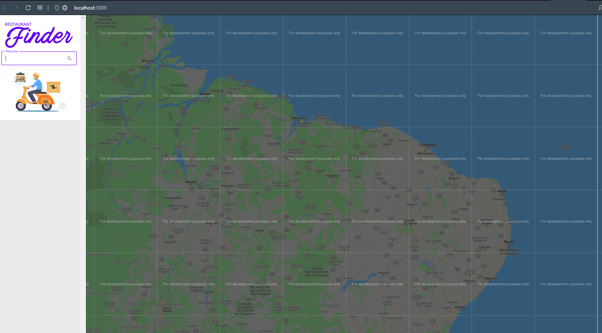

Para iniciar o projeto faça o guia abaixo.

## COMANDOS

### `yarn `
### `yarn start`

# VARIAVEIS

Criar arquivo .env e setar a Chave do Google Api

Explicação aqui: https://developers.google.com/maps/documentation/javascript/get-api-key

# IMAGENS
https://github.com/lourranio/restaurants-find/blob/6af369f96ddefb4e470816a3250be9b6ea5569d7/img/img1.PNG

